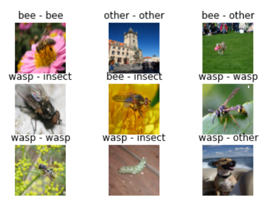

# Bee vs Wasp project

This repository aims at presenting results on Bee vs Wasp project.

## Project description

In this project, Kaggle provides a database which includes images of:

- bee
- wasp
- other insect
- other image with everything but insect.

The main goal of this project here is to train a machine learning algorithm able to recognize whether a given image is a bee, a wasp, an other insect or something else.

The dataset is composed of :
-3183 bee images

- 4943 wasp images
- 2439 insect images
- 856 other thing images.

### Data loader

The first thing to do is to load all images and to resize and normalize them, because they all have different size.
In order to do so, I used a image data generator from tensorflow. It allows to build a data generator with a dataframe which includes the image paths.
The data generator automatically resizes and normalises every images and gives some batchs to the model.

#### Data augmentation

In order to increase the amount of data, I did some operations on every input data :

- image flip
- image rotation
- image zoom.

#### Rebalanced data

The method used in this project is a _Convolutional Neural Network_ (CNN).

## Main results

I used a **Convolutional Neural Network** to classify the images.

I got an accuracy of **80%** on evaluation data.

### Example of image prediction :

